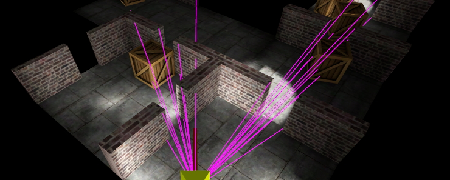

# godot-lportal
Portal rendering / Occlusion culling module for Godot 3.2

You can either use LPortal as a full occlusion culling system if you can create your level as rooms and portals, or use it in a simplified single room mode to speed up culling in any 3d level.

Note that this is a _Work in progress_. Feel free to try out the latest version (master) but recognise that the API may change as I move towards first release.

Video of initial testing:\
https://www.youtube.com/watch?v=uVwLltiouBs \
https://www.youtube.com/watch?v=xF_3Fe2HRdk \
https://www.youtube.com/watch?v=NmlWkkhGoJA

### Features
* Support for dynamic objects (DOBs)
* Dynamic lights
* Optional auto-generation of room bound convex hulls
* Internal lightmapping workflow (for baking lights in Godot)
* External lightmapping workflow (for baking lights in Blender etc)
* Single room mode (for non-portalled levels)

### Demos / Tutorials
https://github.com/lawnjelly/lportal-demos

_Feel free to leave suggestions / feature requests on the issue tracker, especially regarding ease of use._

## Current status
As everything is now basically working, I am currently working on a small demo / test first person shooter game. This is helping me find bugs / add usability features as I go.

Note I'm also currently rewriting the Godot 2d GLES renderer in core, so that has to take priority until it is working.

## Instructions
* [OVERVIEW](OCCLUSION_CULLING.md)
* [INSTRUCTIONS](INSTRUCTIONS.md)
* [INSTRUCTIONS for single room mode](INSTRUCTIONS_SINGLEROOM.md)
* [TUTORIAL](https://github.com/lawnjelly/lportal-demos/tree/master/Tutorial-Simple)

## Roadmap
* Auto conversion of named room spatials and portal mesh instances to LRoom and LPortal DONE
* Auto creation of mirror portals DONE
* Recursive determine visibility DONE
* Prevent memory allocations (use pools for plane vectors) DONE
* Add support for objects moving between rooms - cameras, players, physics etc - DONE
* Handle special cases (multiple portals views into room etc) DONE
* Optimize non-moving statics DONE
* Optional convex hull bound for rooms DONE
* Auto convex hull bound generation DONE
* Add debug graphical view of portal planes DONE
* Add debug graphical view of room bounds DONE
* Dealing with shadows from objects outside of view DONE
* Universal visibility query for camera and dynamic lights DONE
* Support for global directional lights (like the sun) DONE
* Internal baked lightmap workflow DONE
* External baked lightmap workflow DONE
* Switchable culling method DONE
* Bug fixing / testing ONGOING

* Demo game ONGOING
* Shadow caster optimization
* Closable portals
* PVS (primary and secondary)

## Installation

To easily try out I have provided a win64 build under the 'releases' tab in github. However note that for production use on multiple platforms you will have to compile from source.

## Compiling from source

See:
http://docs.godotengine.org/en/3.0/development/compiling/index.html

Once the engine is compiling okay on your system, to add the module:
* Create a folder inside godot/modules called 'lportal'
* Clone / download this repository as a zip file and place the files in the lportal folder
* Compile the engine as normal, it should automatically pick up the lportal module
* Note that to export to other platforms you will also have to compile export templates for those platforms

You will know the installation was successful when you see a new Node type 'LRoomManager' in the Godot IDE.
